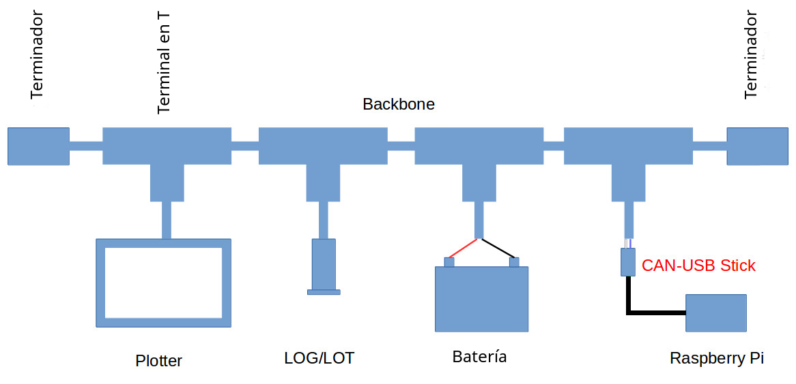

# CAN-USB Stick

## Proyecto

El proyecto del dispositivo CAN-USB Stick se realizó para analizar el flujo de datos en una red N2K enviando y recibiendo mensajes CAN. Está aislada eléctricamente para evitar daños.

El  CAN-USB Stick se basa en un micro controlador \(MCU\) stm32 conectado a un transceptor CAN aislado y a un convertidor USB a serie.

El programa del MCU se ha rediseñado para trabajar conjuntamente con el proyecto [CANBOAT](https://github.com/canboat/canboat), que es utilizado en el proyecto [Signal K](http://signalk.org/). Ambos paquetes se usan en OpenPlotter.

El CAN-USB Stick también funciona con el proyecto [OpenSkipper](http://openskipper.org/).

No se ha probado:

* [MacENC](http://macenc.com/)
* [PolarView NS](http://www.polarnavy.com/)

Por lo tanto utiliza el conjunto de comandos que a su vez se usan en el programa CANBOAT actisense-serie. Desde OpenPlotter también se puede enviar y recibir datos de red N2K directamente.

Los nuevos PGNs no están bloqueados, porque están en otros dispositivos capaces de funcionar con CANBOAT. Se puede establecer una velocidad de transmisión mayor que la velocidad del CAN bus. Otros dispositivos capaces de trabajar con CANBOAT tienen una tasa de transferencia más baja que las redes N2K, por lo que pueden sufrir un efecto de  cuello de botella.


Este artículo está disponible en nuestra [Tienda de la Web](http://shop.sailoog.com).


## Aviso / Descargo de responsabilidad

El CAN-USB Stick es un proyecto de investigación sobre comunicación de datos en CAN bus y redes N2K en barcos.

El software está todavía en desarrollo y no ha sido probado totalmente. En cualquier momento se pueden producir funcionamientos inadecuados del CAN-USB Stick o cualquier dispositivo conectado. Manipular la red N2K podría causar daños en los dispositivos conectados.

No confíe en los datos de este dispositivo y no lo utilice como fuente principal de navegación. No se aceptará ninguna responsabilidad por daños, lesiones personales o mal funcionamiento causados por este dispositivo.

El CAN-USB Stick no está certificado por NMEA®.

No está permitido el uso del software Actisense® NMEA Reader para el dispositivo CAN-USB.

## Redes N2K

Ejemplo de una pequeña red N2K

                                                     Ejemplo de una pequeñ red N2K

Las redes N2K se describen en la [Wikipedia](https://en.wikipedia.org/wiki/NMEA_2000). El tronco \(backbone\) comienza con un terminador de 120Ω y termina con otro terminador de 120Ω. Dos resistencias trabajan en paralelo, por lo que la resistencia es de 120Ω/2=60Ω. Si hubiera una rotura en el tronco, podría medir sólo 120Ω o nada, pero no 60Ω. Es una forma muy fácil de comprobar el bus.

La línea de bajada a los dispositivos no debe ser más larga que 6 m. La linea principal puede tener 100 m de longitud.

El CAN-USB Stick está aislado eléctricamente, por lo que los dispositivos y su ordenador están protegidos, incluso si están alimentados por una fuente diferente a la de su red N2K.

## Conexión

Parar conectar el CAN-USB Stick a la red necesita un tconector en T libe en su tronco \(backbone\) y una línea de bajada. La línea de bajada debería tener un conector macho de 5 pines M12 en un extremo y 5 cables en el otro \(aunque sólo necesitemos 2\). El conector  HIRSCHMANN ELST 5012 PG7 tiene un terminal de tornillo.

* Pull out the green screw terminal of the stick.
* Connect the drop line blue wire from pin 5 \(pin in the middle\) to the green terminal on CANL.
* Connect the drop line white wire from pin 4 to the green terminal on CANH.
* Turn off the main power switch to be sure that there is no power on the network.
* Connect the drop line to the free T-connector on your backbone.
* Use a multimeter and measure the resistance between CANH and CANL \(on the screws\). The resistance should be around 60 Ohm.
* Connect the green screw terminal to the CAN-USB Stick.
* Check again the 60 Ohm between CANH and CANL.
* On the drop line there are three cables left. They have to be isolated.
* Turn on the main power.
* Switch on instrumentation.

To configure your CAN-USB Stick on Windows use OpenSkipper To configure it on OpenPlotter go to chapter:



## LED

The CAN-USB Stick LED will be **OFF** 10" during the boot sequence and then:

* Fixed **ON** if it is not connected to the network.
* **ON** for a second if it is connected to the network.
* Fixed **OFF** if there are not input data.
* **FLASHING** if there are input data.

## Support

If you need support or you have any suggestion you can publish your questions on [OpenMarine forum](http://forum.openmarine.net/forumdisplay.php?fid=11).

