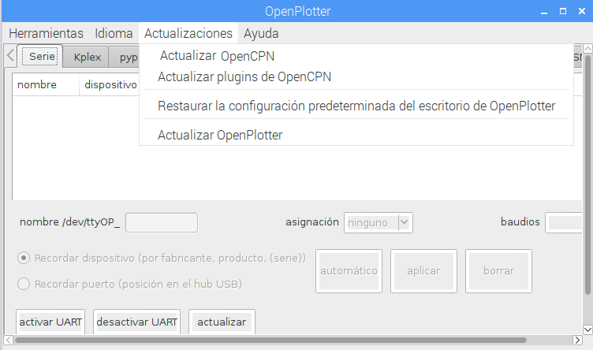
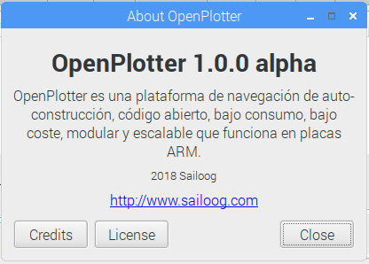

# Empezando

Antes que nada reúna por lo menos los elementos requeridos de hardware:



Después, ejecute el software en su Raspberry. **OpenPlotter** es una versión modificada de [Raspbian](https://www.raspbian.org/), el sistema operativo oficial para la Raspberry Pi. Tiene todo lo que pueda necesitar. OpenPlotter es software de código abierto y libre.

## Instalando OpenPlotter

Raspberry Pi, y la mayoría de sistemas embebidos, utilizan una tarjeta micro-SD como disco duro. Casi todas las tarjetas compatibles micro-SD funcionarán en su Raspberry.


Se requiere un mínimo de 8GB pero se recomiendan 16GB.


Para empezar, es siempre una buena idea asegurarse de que ha formateado su tarjeta SD. Asegúrese de que su ordenador tiene un lector de tarjetas SD integrado o utilice, en otro caso, un lector USB de tarjetas SD.

* Visite la [Web de la Asociación SD](http://www.sdcard.org) y descargue el programa [SD Formatter](https://www.sdcard.org/downloads/formatter_4/index.html) para Windows o Mac.
* Siga las instrucciones para instalar el programa.
* Inserte su tarjeta SD en lector de tarjetas SD de su ordenador o portátil y tome nota de la letra de unidad asignada a aquella, por ejemplo `F:/`
* En SD Formatter, selecciones la letra de unidad de su tarjeta SD y formatéela.


Si su tarjeta SD tiene 64GB o más, será automáticamente formateada como exFAT, que no es compatible con OpenPlotter. Siga [estas instrucciones](https://www.raspberrypi.org/documentation/installation/sdxc_formatting.md) para formatear su tarjeta SD como FAT32 para que pueda usar OpenPlotter.


* [Bájese la última versión del instalador NOOBS de **OpenPlotter**](http://www.sailoog.com/blog-categories/openplotter-rpi)**.** Es un archivo comprimido de cerca de 1GB, por lo que puede llevar un tiempo. 
* Descomprima el archivo **openplotter\_vx.x.x\_noobs.zip**
* Seleccione todos los archivos y carpetas presentes dentro de la carpeta extraída NOOBS y arrástrelos adentro de la tarjeta SD.
* Así, todos los archivos necesarios se transferirán a la tarjeta SD.
* Cuando haya terminado, extraiga en modo seguro la tarjeta SD e insértela en su  Raspberry Pi.

## Primer arranque

Conecte la alimentación a su Raspberry Pi.

El instalador NOOBS de OpenPlotter hará una instalación silenciosa; esto es, usted no tendrá que hacer nada. Este proceso tardará unos cuantos minutos, para formatear e instalar el sistema.

Una vez que el instalador NOOBS de Once the OpenPlotter haya terminado de instalar el sistema, OpenPlotter se iniciará automáticamente cada vez que conecte la Raspberry Pi.

Se autodetectará la resolución nativa del monitor de 800x480. ¡La configuración correcta funcionará en el próximo arranque! Si tiene un monitor, reinície el sistema de nuevo.

OpenPlotter está configurado por defecto como un punto de acceso WiFi. Puede conectarse a él usando esta contraseña:

Nombre de la red \(SSID\): openplotter  
Contraseña: 12345678


Debe cambiar la contraseña lo antes que pueda. Debiera cambiar también otras configuraciones importantes; por favor, vaya a la página _Configuraciones iniciales_ para ver cómo hacerlo. 




También puede ejecutar OpenPlotter en modo sin monitor, usando cualquier portátil, ordenador de sobemesa, tableta o smartphone como cliente de escritorio remoto.



## Actualizando

Desde OpenPlotter  v1.0.0 puede actualizar su instalación sin necesidad de grabar de nuevo la tarjeta SD.

Asegúrese de estar conectado a Internet y vaya a _Actualizaciones_ en el menú principal de OpenPlotter y después a \[_Update OpenPlotter\]_. OpenPlotter comprobará si necesita una actualización mayor o menor  y hará todo el trabajo por usted.

También puede actualizar OpenCPN y sus plugins a la última versión estable liberada y restaurar las configuraciones de escritorio si ha habido cambios tras una actualización.

### Numeración de las versiones {#version-numbering}

Las versiones de OpenPlotter usan tres números: **a**.**b**.**c** \(v0.10.0, v1.0.0...\) y una palabra \(**alpha**, **beta** y **stable**\).

Cuando aumenta **c**, hay un cambio menor y significa que sólo ha cambiado el código de OpenPlotter. Cuando aumenta **b**, hay un cambio mayor y significa que otros paquetes o dependencias necesitan ser añadidas o actualizadas también. Cuando **a** aumenta, significa que es una nueva versión y signfica que Raspbian necesita actualizarse a una nueva versión. En este caso, una nueva imagen de OpenPlotter será liberada y puede grabarla a una tarjeta SD.

**Alpha** significa que algunas partes todavía necesitan desarrollo. **Beta** quiere decir que todas las partes se han desarrollado y no hay errores graves pero todavía necesita ser testeada por los usuarios en distintos escenarios. El texto se traduciá de inglés a otros idiomas en esta fase. **Stable** **\(estable\)** significa que el código de OpenPlotter y las dependencias han sido probadas y no hay errores.

Puede conocer qué versión está ejecutando seleccionando la opción _Acerca de_ en el menú _Ayuda_.

## Backup

## Recovery system

If our system gets damaged or unstable, we can recover it from the NOOBS installer that resides on your SD and install OpenPlotter again. Press the Shift key when you see this symbol at startup:


**You will lose all data, manually installed programs and settings after recovering.**


