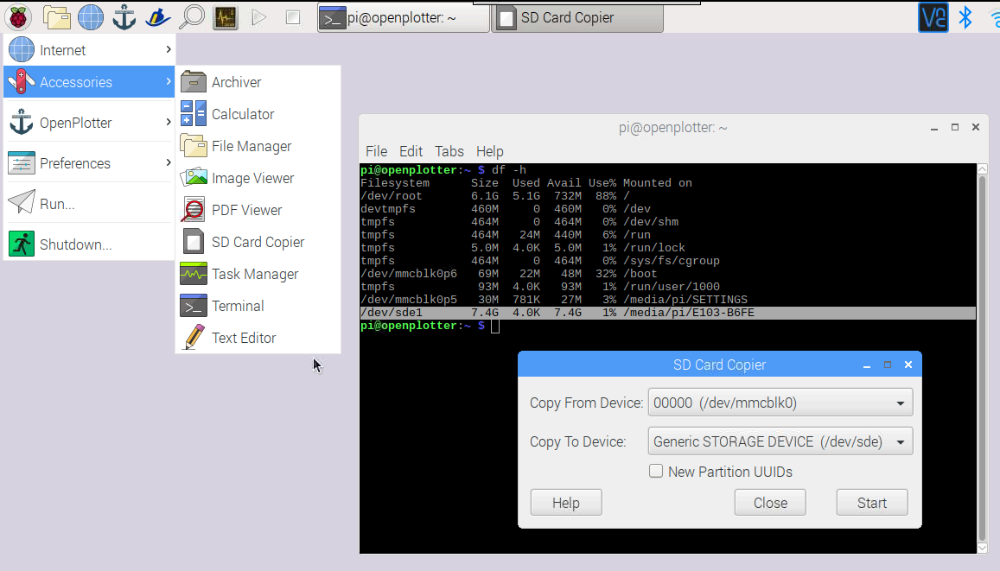

# Getting started

First of all you have to put together at least all the required hardware parts:



Then, you have to run the software on your Raspberry. **OpenPlotter** is a modified version of [Raspbian](https://www.raspbian.org/), the official operating system for the Raspberry Pi. It contains all you need. OpenPlotter is open-source and free.

## Installing OpenPlotter

Raspberry Pi, and most embedded systems, uses an SD card as Hard Disk. Almost any micro-SD-compatible card will work on your Raspberry.


A minimum of 8GB is required but 16GB is recommended.


To begin with, it's always a good idea to make sure you have formatted your SD card. You'll need to make sure your computer has a built-in SD card reader, or you can use an USB SD card reader.

* Visit the [SD Association’s website](http://www.sdcard.org//) and download [SD Formatter](https://www.sdcard.org/downloads/formatter_4/index.html) program for either Windows or Mac.
* Follow the instructions to install the software.
* Insert your SD card into the computer or laptop’s SD card reader and make a note of the drive letter allocated to it, e.g. `F:/`
* In SD Formatter, select the drive letter for your SD card and format it.


If your SD card has 64GB or more, it will automatically be formatted as exFAT, which is not compatible with OpenPlotter. Follow [these instructions](https://www.raspberrypi.org/documentation/installation/sdxc_formatting.md) to force your SD card to format as FAT32 so that you can use OpenPlotter.


* [Download the latest NOOBS installer version of **OpenPlotter**](http://www.sailoog.com/blog-categories/openplotter-rpi)**.** It is a compressed file of about 1GB so it will take a while. 
* Extract the files from the compressed file **openplotter\_vx.x.x\_noobs.zip**
* Drag all the files in the extracted NOOBS folder and drop them onto the SD card drive.
* The necessary files will then be transferred to your SD card.
* When this process has finished, safely remove the SD card and insert it into your Raspberry Pi.

## First boot

Connect power to the Raspberry Pi.

OpenPlotter NOOBS installer will make a silent install, this means that you have to do nothing. It will take several minutes to format partitions and install the system.

Once the OpenPlotter NOOBS installer has installed the system, OpenPlotter will start directly every time we connect the Raspberry Pi.

The native monitor resolution for 800x480 monitors will be auto detected. The right settings for it will work on the next boot! If you have such a monitor, restart.

OpenPlotter is configured as a WiFi access point by default. You can connect to it using this pasword:

SSID: openplotter  
Password: 12345678


You should change this password as soon as possible. Other important settings should be changed, please go to _First settings_ page to know how.




You can also run OpenPlotter without monitor \(headless\) using any laptop, desktop computer, tablet or smart-phone as a remote desktop client.



## Updating

From OpenPlotter  v0.10.0, you can update your installation without need of burning a new SD card.

Be sure you are connected to Internet and go to _Updates_ in the OpenPlotter main menu and then to _Update OpenPlotter_. OpenPlotter will check if you need to do a minor or a major update and it will do all the work for you.

You can also update OpenCPN and plugins to the latest stable releases and restore the desktop settings if it has changed after an update.

### Version numbering {#version-numbering}

OpenPlotter releases have three numbers: **a**.**b**.**c** \(v0.10.0, v1.0.0...\) and a word \(**alpha**, **beta** and **stable**\).

When **c** increases, there is a minor change and means that only the OpenPlotter code has changed. When **b** increases, there is a major change and means that other packages or dependencies need to be added or updated too. When **a** increases, there is an upgrade and means that Raspbian needs to be upgraded. In this case a new OpenPlotter image will be released and you have to burn a new SD card.

**Alpha** means that some parts still need development. **Beta** means that all parts have been developed and there are not fatal errors but it needs to be tested by users in different scenarios. Text will be translated from English into other languages on this stage. **Stable** means that OpenPlotter code and dependencies have already been tested and there are not errors.

You can know what version you are running selecting the option _About_ in _Help_ menu.

## Backup

We strongly recommend to make a copy of your system when you are happy with your configuration. SD cards are not the most reliable devices and they can fail. Having a backup allows you to easily replace your system, just extract your failing SD and insert the backup SD.

Put a fat 32 formatted SD card in an USB card writer and plug it into your Pi.

Open a _Terminal_ from _Accessories_ menu and type:

 `df -h`

You will get a list of mounted devices. Check the right device name, in my case _/dev/sde1_. Ignore the last character that should be a number, in my case _1_.

Open _SD Card Copier_ from _Accessories_ menu. In _Copy From Device_ select the internal SD card _/dev/mmcblk0_. In _Copy To Device_ select the device that matches the device from the terminal list, in my case _/dev/sde_.


**Do not check** _New Partition UUIDs_ or something could not work right on your copy.


Press _Start_, wait 10 or 15 minutes and you are done.

If you do not have an USB card writer you can use the same method you would use to write an image to a new card, **but in reverse**. Here are the instructions to do this from you preferred system:

* [Linux](https://www.raspberrypi.org/documentation/installation/installing-images/linux.md)
* [MAC OS](https://www.raspberrypi.org/documentation/installation/installing-images/mac.md)
* [Windows](https://www.raspberrypi.org/documentation/installation/installing-images/windows.md)

## Recovery system

If our system gets damaged or unstable, we can recover it from the NOOBS installer that resides on your SD and install OpenPlotter again. Press the Shift key when you see this symbol at startup:


**You will lose all data, manually installed programs and settings after recovering.**


