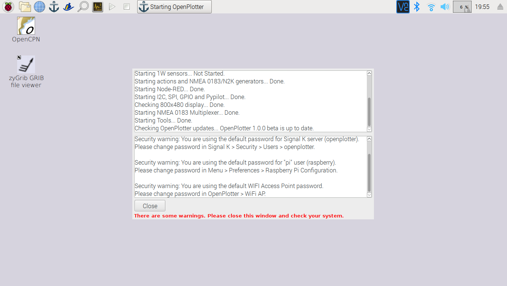

# Par où commencer?

Tout d'abord, il vaus faut assembler les éléments prérequis:



Puis, éxécuter le logiciel sur votre Raspberry. **OpenPlotter** est une version modifiée de Ra[spbian](https://www.raspbian.org/), l'OS officiel pour Raspberry Pi. Tout ce dont vous avez besoin est inclus. OpenPlotter est open-source et gratuit.

## Installer OpenPlotter

Raspberry Pi, ainsi que la plupart des systèmes inclus, utilise une carte SD en tant que disque dur. Presque toutes les cartes micro-SD-compatible fonctionneront avec votre Raspberry.


8GB minimum sont requis, mais 16GB sont recommandés.


Un bon commencement est de vérifier que la carte SD est formattée. Assurez-vous que votre ordinateur dispose d'un lecteur de Cartes SD intégré, à défault, vous pourrez en utiliser un USB.

* Télécharger [SD Formatter](https://www.sdcard.org/downloads/formatter_4/index.html) \(pour Windows ou Mac\) depuis le [site de l'Association SD Card](http://www.sdcard.org//).
* Suivre les instructions pour installer le logiciel.
* Insérer votre carte SD dans le lecteur de carte de l'ordinateur ou du portable  et noter le disque alloué`ici F:/`
* Dans SD Formatter, sélectionner le disque correspondant à votre carte SD et formater.


Si votre carte SD est de 64GB ou plus, elle sera automatiquement formatée en exFAT, ce qui n'est pas compatible avec OpenPlotter. Suivez ces [instructions](https://www.raspberrypi.org/documentation/installation/sdxc_formatting.md) pour forcer le formatage de votre carte SD en FAT32, afin de pouvoir utiliser.


* [Download the latest NOOBS installer version of **OpenPlotter**](http://www.sailoog.com/blog-categories/openplotter-rpi)**.** It is a compressed file of about 1GB so it will take a while. 
* Extract the files from the compressed file **openplotter\_vx.x.x\_noobs.zip**
* Drag all the files in the extracted NOOBS folder and drop them onto the SD card drive.
* The necessary files will then be transferred to your SD card.
* When this process has finished, safely remove the SD card and insert it into your Raspberry Pi.

## Premier démarrage

Connect power to the Raspberry Pi.

OpenPlotter NOOBS installer will make a silent install, this means that you have to do nothing. It will take several minutes to format partitions and install the system.

Once the OpenPlotter NOOBS installer has installed the system, OpenPlotter will start directly every time we connect the Raspberry Pi.

The native monitor resolution for 800x480 monitors will be auto detected. The right settings for it will work on the next boot! If you have such a monitor, restart.

OpenPlotter is configured as a WiFi access point by default. You can connect to it using this pasword:

SSID: openplotter  
Password: 12345678


You should change this password as soon as possible. Other important settings should be changed, please go to _First settings_ page to know how.




You can also run OpenPlotter without monitor \(headless\) using any laptop, desktop computer, tablet or smart-phone as a remote desktop client.



## Mettre à jour

From OpenPlotter  v0.10.0, you can update your installation without need of burning a new SD card.

Be sure you are connected to Internet and go to _Updates_ in the OpenPlotter main menu and then to _Update OpenPlotter_. OpenPlotter will check if you need to do a minor or a major update and it will do all the work for you.

You can also update OpenCPN and plugins to the latest stable releases and restore the desktop settings if it has changed after an update.

### Numérotation des versions {#version-numbering}

OpenPlotter releases have three numbers: **a**.**b**.**c** \(v0.10.0, v1.0.0...\) and a word \(**alpha**, **beta** and **stable**\).

When **c** increases, there is a minor change and means that only the OpenPlotter code has changed. When **b** increases, there is a major change and means that other packages or dependencies need to be added or updated too. When **a** increases, there is an upgrade and means that Raspbian needs to be upgraded. In this case a new OpenPlotter image will be released and you have to burn a new SD card.

**Alpha** means that some parts still need development. **Beta** means that all parts have been developed and there are not fatal errors but it needs to be tested by users in different scenarios. Text will be translated from English into other languages on this stage. **Stable** means that OpenPlotter code and dependencies have already been tested and there are not errors.

You can know what version you are running selecting the option _About_ in _Help_ menu.

## Sauvegarde

## Système de restauration

If our system gets damaged or unstable, we can recover it from the NOOBS installer that resides on your SD and install OpenPlotter again. Press the Shift key when you see this symbol at startup:


**You will lose all data, manually installed programs and settings after recovering.**


