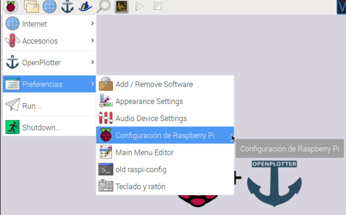
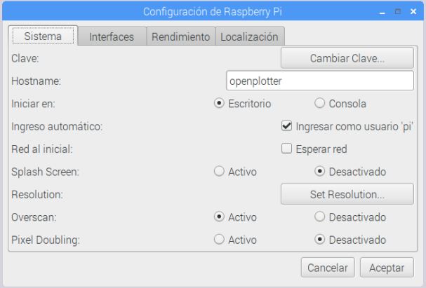
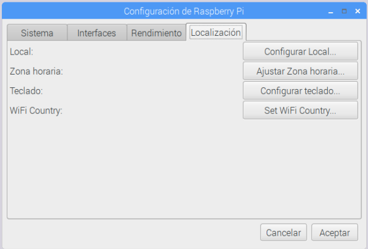

# Primeras configuraciones

## Cambiar el idioma de su sistema operativo \(Raspbian\)

Tras el primer arranque su sistema estará probablemente en inglés. Siga las siguientes instrucciones para cambiar el idioma del sistema.

Vaya a _Menu &gt; Preferences_ y seleccione _Raspberry Pi Configuration_ 

Se abrirá una ventana donde usted podrá personalizar su sistema. Vaya a la pestaña _Localisation_ y pinche el botón _Set Locale..._

En el cuadro de diálogo que se le abre, cambie las siguientes configuraciones: _Language_ \(idioma\), elija es \(Spanish\) en la lista desplegable; _Country_ \(país\) elija el que corresponda en lista desplegable. Pulse _Ok_.

Cuando vuelva al cuadro _Raspberry Pi Configuration_ pulse Ok. En ese momento le aparecerá un mensaje en el que se le dice que "_Para que los cambios surtan efecto debe reiniciar la Raspberry Pi. ¿Desea reiniciarla ahora?_". Pulse _Yes_ para reiniciar.

## Ajustes generales

Vaya a _Menu &gt; Preferencias_ y seleccione _Configuración de Raspberry Pi  \(en un primer arranque usted encontrará el sistema en inglés\)_

Se abrirá una ventana donde usted podrá personalizar su sistema. 


Es una buena idea cambiar la contraseña para hacer OpenPlotter más seguro. Clique en _Cambiar Clave_ \(contraseña por defecto: raspberry\).

Si no cambia la contraseña cualquiera podrá conectarse a OpenPlotter de forma remota. Por favor, hágalo AHORA.


Si necesita cambiar el idioma de su sistema o configuraciones locales, haga clic en la pestaña _Localización_ y después utilice los botones _Configurar Local_ \(idioma\), _Ajustar Zona horaria_, _Configurar teclado_ o _Set Wifi Country_ \(seleccione el país en el que usa el Wifi\).

## Configuraciones de red


Si está habilitado el punto de acceso Wifi, por favor cambie la contaseña por defecto cuanto antes en la pestaña _Red_. En esa pestaña podrá deshabilitar el punto de acceso o establecer algún otro modo de red.




## Signal K settings

Signal K server provides many useful tools and you will have to visit its administration panel often. Go to _Menu_ &gt; _OpenPlotter_ &gt; _Signal K._

#### Password

Data visualization is open but settings is under authentication. Press _Login_ button upper right.

User name: openplotter  
Password: openplotter


Please change this password as soon as possible. Login and go to _Signal K_ &gt; _Security_ &gt; _Users_ &gt; _openplotter_


#### Vessel data

If you are going to share data with other boats you should have an unique identifier. Login to Signal K and go to _Server_ &gt; _Vessel_ _data_ and change at least your boat name and MMSI.

Here you can also provide data about your boat that could be useful for some Signal K tools.

