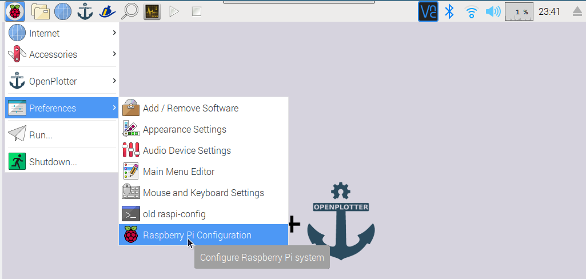
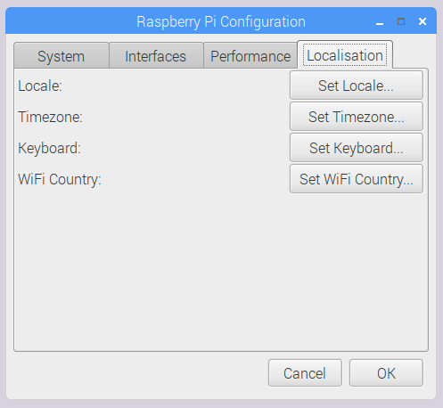
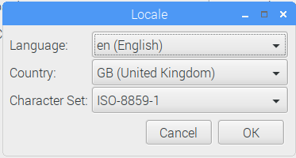
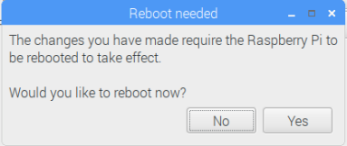

# Primeras configuraciones

## Cambiando el idioma de su sistema operativo \(Raspbian\)

Tras el primer arranque su sistema estará probablemente en inglés. Siga las siguientes instrucciones para cambiar el idioma del sistema.

Vaya a _Menu &gt; Preferences_ y seleccione _Raspberry Pi Configuration_ 

Se abrirá una ventana donde usted podrá personalizar su sistema. Vaya a la pestaña _Localisation_ y pinche el botón _Set Locale..._

En el cuadro de diálogo que se le abre, cambie las siguientes configuraciones: _Language_ \(idioma\), elija es \(Spanish\) en la lista desplegable; _Country_ \(país\) elija el que corresponda en lista desplegable. Pulse _Ok_.

Cuando vuelva al cuadro _Raspberry Pi Configuration_ pulse Ok. En ese momento le aparecerá un mensaje en el que se le dice que "_Para que los cambios surtan efecto debe reiniciar la Raspberry Pi. ¿Desea reiniciarla ahora?_". Pulse _Yes_ para reiniciar.

## Ajustes generales

Vaya a _Menu &gt; Preferences_ y seleccione _Raspberry Pi Configuration \(en un primer arranque usted encontrará el sistema en inglés\)_

Se abrirá una ventana donde usted podrá personalizar su sistema. 


It is a good idea to change the password to make OpenPlotter more secure. Click on _Change Password_ \(default password: raspberry\).

If you do not change the password, anyone will be able to connect to OpenPlotter remotely. Please do it now.


If you need to set your system localisation, click on the _Localisation_ tab and then on _Set Locale_ \(language\), _Set Timezone, Set Keyboard_ and _Set WiFi Country_ buttons.

## Network settings


If a WiFi access point is enabled please change the default password as soon as possible in _Network_ tab. There you can disable the access point or set another network mode too.




## Signal K settings

Signal K server provides many useful tools and you will have to visit its administration panel often. Go to _Menu_ &gt; _OpenPlotter_ &gt; _Signal K._

#### Password

Data visualization is open but settings is under authentication. Press _Login_ button upper right.

User name: openplotter  
Password: openplotter


Please change this password as soon as possible. Login and go to _Signal K_ &gt; _Security_ &gt; _Users_ &gt; _openplotter_


#### Vessel data

If you are going to share data with other boats you should have an unique identifier. Login to Signal K and go to _Server_ &gt; _Vessel_ _data_ and change at least your boat name and MMSI.

Here you can also provide data about your boat that could be useful for some Signal K tools.

