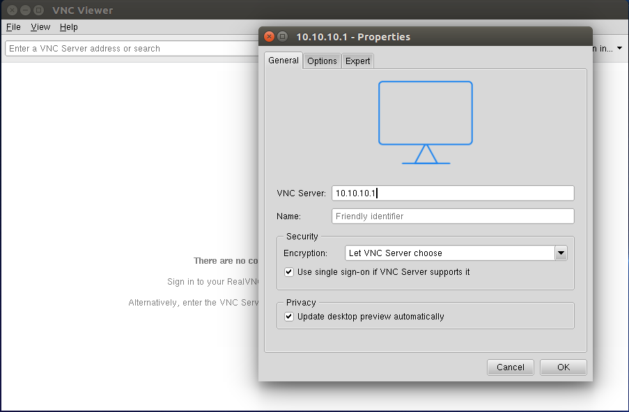
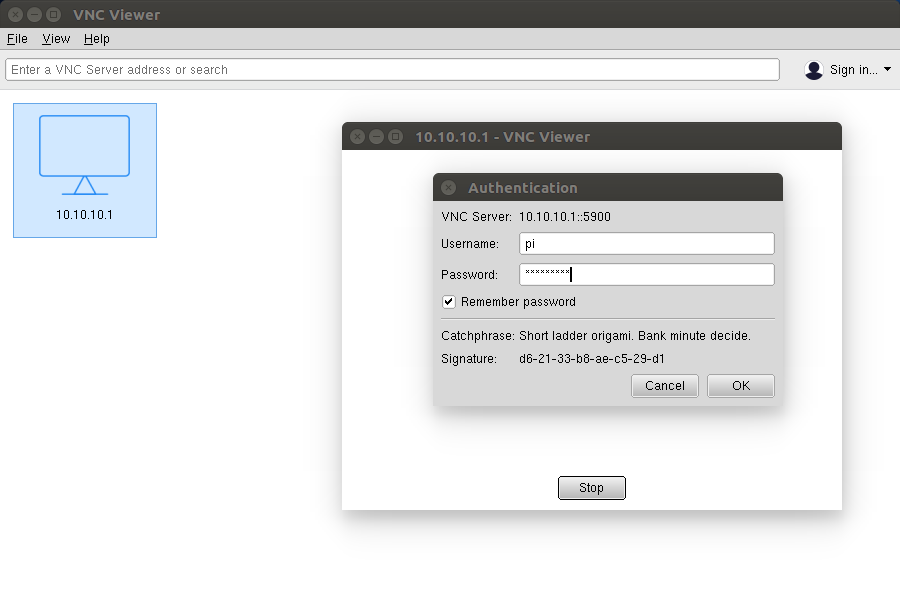

# Headless

## First boot

After creating the SD with OpenPlotter NOOBS installer, insert it into your Raspberry Pi, connect power and wait until a new WiFi network _openplotter_ appears on the list of available access points.

SSID: openplotter  
Password: 12345678


Please change the password as soon as possible in WiFi AP tab




## Connecting

* Install [RealVNC Viewer](https://www.realvnc.com/en/connect/download/viewer/) on your laptop, desktop computer, tablet or smart-phone
* Open VNC Viewer and select _File -&gt; New connection_
* Introduce the OpenPlotter address and press _OK._ If OpenPlotter is working as access point, the address is **10.10.10.1**_._ If it is working as client of an access point, you have to find out what address has the access point given to OpenPlotter.

* Introduce the _Username_: pi
* Introduce the _Password_: raspberry
* Select _Remember password_, press _OK_ and you are in!


Please change this password as soon as possible. See _Getting started_, _first settings_




