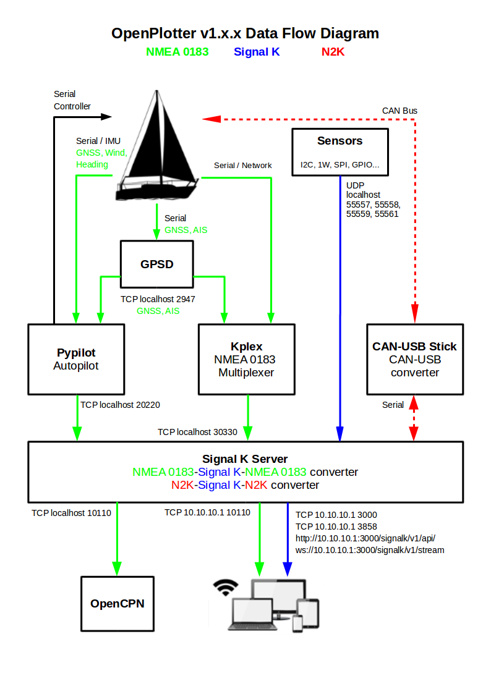

# Comment cela marche ??

OpenPlotter gére des données au format NMEA 0183, NMEA 2000 et Signal K.

Tout flux entrant en format NMEA 0183 ou 2000 est traduit au format Signal K. Certains capteurs génèrent directement des flux en au format Signal K.

Une fois le flux converti en Signal K, vous pouvez l'afficher dans différentes applications ou encore, le convertir de nouveau en NMEA 0183 ou 2000 pour le renvoyer vers d'autres appareils ou applications.

## Le flux de données

## NMEA 0183

OpenPlotter peut recevoir des données NMEA 0183 de dispositifs connectés en série \(USB, UART...\) ou en se connectant à des sources réseau TCP ou UDP.

Configurez les appareils série via l'onglet _Série_ et les connections réseau via l'onglet _Kplex_:





Le serveur Signal K reçoit les trames NMEA 0183. Il convertit les phrases qu'il comprend, au format Signal K et transfert les données NMEA 0183 sources vers le port TCP 10110.

Si vous avez des appareils qui génèrent des données au format NMEA 2000 ou Signal K et que vous voulez aussi les transférer en NMEA 0183 et les expédier au port TCP 10110, vous devrez activer les phrases NMEA 0183 correspondantes, quand elles existent, dans le pluging _Convert Signal K to NMEA 0183_ :



## NMEA 2000

Pour recevoir et transmettre des données NMEA 2000 il vaus faut utiliser un adaptateur série, du genre de notre Stick CAN-USB. Le  NGT-1 Actisense est également compatible.



Le dispositif doit être défini dans l'onglet _Serial_  puis configuré dans l'onglet C_AN_ . Si vous avez des appareils générant des données NMEA 0183 ou Signal K et que vous voulez les traduire en NMEA 2000 puis les diriger vers votre appareil série NMEA 2000, vous devez autoriser la réception de ces PGN sur votre appareil. Vous devez également sélectionner quelle clefs Signal K vous voulez transmettre:



## SIGNAL K

Les données NMEA 0183 et 2000 des appareils définis sont traduites en Signal K automatiquement.

Les données sources des capteurs IMU - GPIO - I2C - 1W - SPI - MQTT, ainsi que quelques outils sont convertis en Signal K, après qu'ils aient été définis dans l'onglet correspondant.

















Si vous voulez convertir des données Signal K depuis ces sources vers du NMEA 0183 ou 2000, vous devez d'abord vérifier si la phrase NMEA 0183 ou le PGN NMEA 2000 existe pour ces données. Voir les sections précédentes pour savoir comment le faire.

