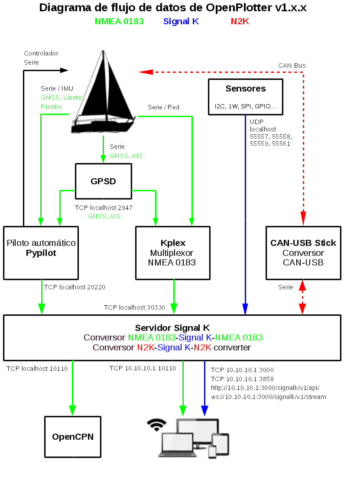

# ¿Cómo funciona?

OpenPlotter puede manejar datos NMEA 0183, NMEA 2000 y Signal K.

Todos los datos recibidos en formato NMEA 0183 y 2000 son convertidos a formato Signal K. Algunos sensores generan directamente datos en formato Signal K.

Una vez que los datos se han convertido a Signal K, usted puede mostrarlos en distintas aplicaciones, para visualizarlos o convertirlos de nuevo a NMEA 0183 y 2000 para enviarlos a otros dispositivos o aplicaciones.

## Flujo de datos

## NMEA 0183

OpenPlotter puede obtener datos NMEA 0183 desde dispositivos serie conectados \(USB, UART...\) o conectándose a fuentes de datos en red TCP o UDP.

Defina  dispositivos serie en la pestaña _Serie_ y conexiones de red en la pestaña _Kplex_:





El servidor Signal K obtiene datos NMEA 0183, convierte todas las sentencias NMEA 0183 que puede entender en formato Signal K y transmite los datos puros NMEA 0183 a puertos TCP 10110.

Si tiene dispositivos que generen datos NMEA 2000 o datos Signal K y los quiere traducir a NMEA 0183 y enviarlos también a puertos TCP 10110, tendrá que habilitar las sentencias NMEA 0183 que necesite en el plugin \[_Convert Signal K to NMEA 0183\]_ cuando existan:



## NMEA 2000

Para obtener y enviar datos NMEA 2000 necesita conectar un convertidor serie como nuestro  CAN-USB stick. El Actisense NGT-1 también es compatible.



Debe definir dispositivos serie en la pestaña _Serie_  y configurarlos en la pestaña _CAN_. Si tiene dispositivos que generen  datos NMEA 0183 o Signal K y los quiere traducir a NMEA 2000 y enviarlos a un dispositivo serie NMEA 2000, tendrá que permitir la recepción para aquellos datos PGN en su dispositivo y seleccionar qué claves Signal K quiere transmitir:



## SIGNAL K

Los datos de dispositivos definidos como NMEA 0183 y 2000 son traducidos a Signal K automáticamente.

Datos puros desde sensores IMU - GPIO - I2C - 1W - SPI, MQTT y algunas herramientas son convertidos en Signal K, una vez hemos definido esos elementos en sus correspondientes pestañas.

















Si quiere convertir datos Signal K desde sus fuentes NMEA 0183 o 2000, deberá comprobar primero si las sentencias NMEA 0183 o PGN existen para esos datos. Vea las secciones anteriores para saber cómo hacerlo.

