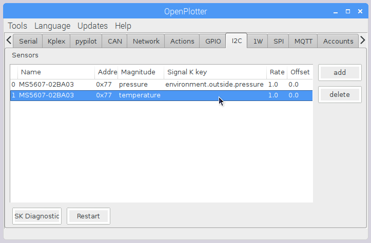
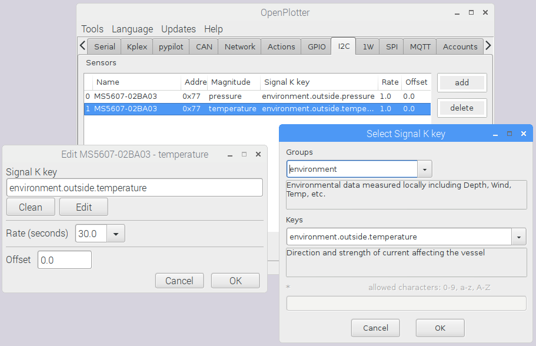
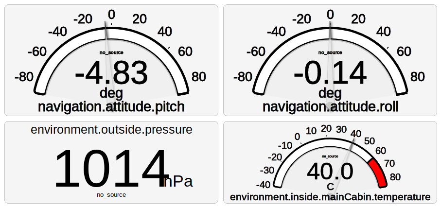

# I2C

To configure your I2C sensors go to _I2C_ tab and press _add_.

OpenPlotter will check the connected I2C devices and will show you a list of possible models according to their addresses. You can refresh this list pressing _Reset_ or see the detected addresses pressing _Addresses_.

If your device is not listed and you know its address select the model in _add/update sensor_ field and write its real address.

Press OK when you are ready.

A list of features of your device will be added to the sensors list. Some features will have a Signal K key pre-assigned when its function is obvious. Some features with more than one possible Signal K key assignation will be blank.

Double click on the feature you want to edit to change its parameters.

Select the _Signal K key_ that best suits your needs. If you have a temperature sensor probably you do not need to send data every second, you can define this frequency in _Rate_ field. If you think that you sensors could have any deviation you can correct it setting an _Offset_. Press _OK_ when you are ready.

Go to any Signal K data viewer and check your sensor is sending data.

