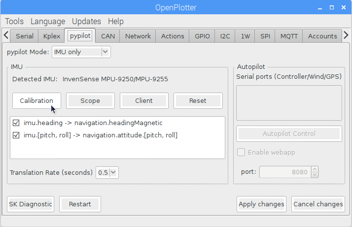
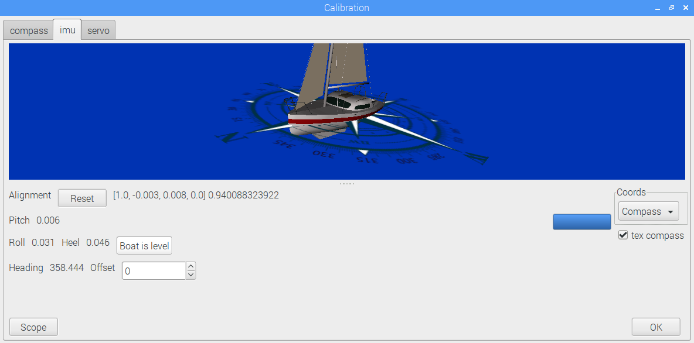
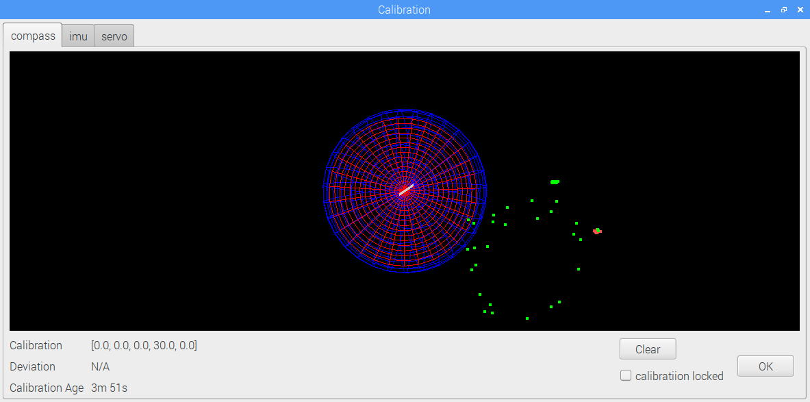
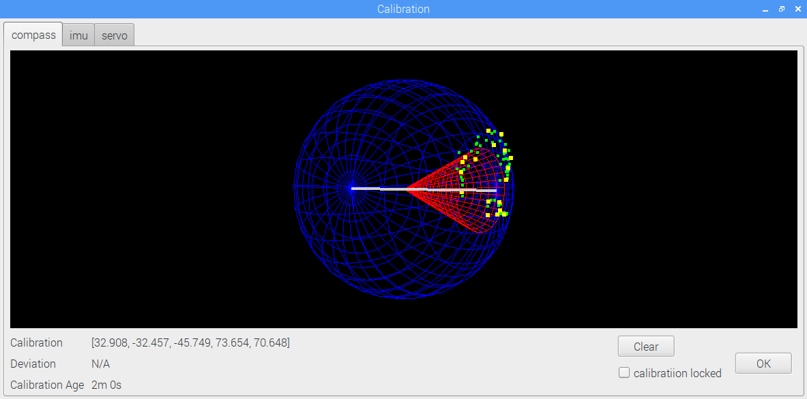

# Compass calibration

Place the IMU on its final position on board and away from possible sources of interference, especially from speakers.

Select _IMU only_ in _pypilot Mode_ or _basic autopilot_ if you have a pypilot installation.

Press _Calibration_.

Being moored in port and the boat as more levelled as possible, go to _imu_ tab and press _Boat is level_. After few seconds the 3D boat should be levelled.

If your IMU is not pointing to bow you can set an offset.

Do not close the Calibration window, select the _compass_ tab and go sailing normally. The system will collect data from the IMU every 2 minutes.

When there are more than 60 degrees of heading variation and the collected points are valid, calibration will perform. The points will fit the blue sphere and a red cone will wrap them.

If enough valid data have been collected, the system will re-calibrate every 2 minutes . Every 5 minutes, calibration and level data are saved to be used on next sessions.

