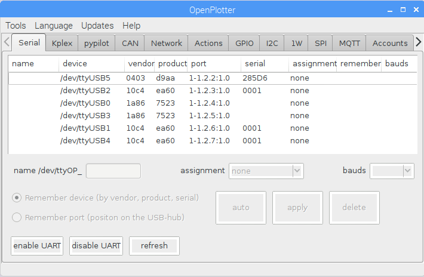
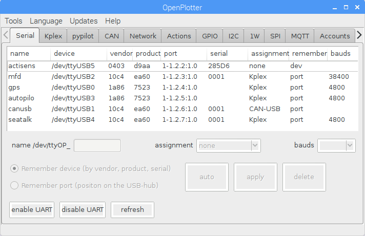
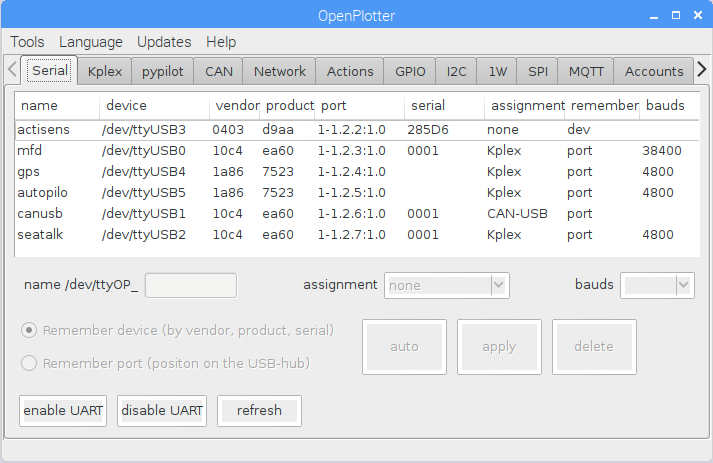

# Serial devices

Many devices use a serial protocol. To avoid problems with the identification of these devices some settings and assignments have to be made. The automatic port naming in Linux isn't good enough for openplotter. Wrong or not made settings at this point affect the stable functioning because: 

1. port names on Linux can change on every boot 

2. ports which power up on different times get names depending of the time they are switched on \(this happens when someone wants to save power, use hot plug ability or activates and deactivates devices connected to the raspberry pi\) 

3. some devices have no serial numbers, Linux can not distinguish them uniquely.

To solve points 1 and 2 you enter self-explanatory name \(max 8 letters\) in the field _name /dev/ttyOP\__. 


To solve point 3 you have to choose whether your devices are clearly different from each others or not. This is only the case if the combination of vendor product and serial differ \(this does not apply to the pictures below\). A problem arises only if you use more than one adapter of the type prolific, ch340 or CP210x. Multiport serial devices of any type \(also ftdi\) have same problem. Use _Remember port \(position on the USB-hub\)_! 

Warning from now you have reserved this usb slot exactly for this device!


To solve point 3 you have to choose whether your devices are clearly different from each others or not. This is only the case if the combination of vendor product and serial differ \(this does not apply to the picture below\). A problem arises only if you use more than one adapter of the type prolific, ch340 or CP210x. Multiport serial devices of any type \(also ftdi\) have same problem. Use _Remember port \(position on the USB-hub\)_!!! Warning from now you have reserved this usb slot exactly for this device!

Next, openplotter must be told what the device is to be used for. You can choose 

* _none_ if you use a serial device \(for example slcan device or arduino firmata\) which isn’t managed by openplotter 
* _Kplex_ if it is an NMEA0183 device.\(direct impact on the page kplex\) -pypilot if it is a pypilot device \(direct impact on the page pypilot\) 
* CAN-USB if it is the openplotter CAN-USB or an actisense ngt-1 device \(direct impact on the page CAN\) 
* _GPSD_ can be used for GPS with binary mode \(direct impact on the page kplex\) 
* _SMS_ if you want send SMS with a UMTS USB-Stick \(direct impact on the page SMS\) 
* _NMEA_ 0183 out if you want to send NMEA from SignalK \(kplex can’t do any other multiplexing\) 

In some cases you have to select the speed of the serial ports. Typical speed for NMEA0183 is 4800. AIS on NMEA0183 uses 38400. Typical speed for CAN-USB is 115200 or 230400 or 921600 \(future\)

The auto button should facilitate the configuration of the selected device \(experimental\).


If you really know what you are doing with gpio ttl \(GPIO14 TXD0 and GPIO15 RXD0\) you can use: 

* _enable UART_  This disables the raspberry pi bluetooth serial port and enables the serial gpio ttl.
* _disable UART_  This enables the raspberry pi bluetooth serial port\(default\)


In this example you see 6 serial devices

Only one device is clearly different.

There are two devices with vendor 1a86 and three with 10c4. These devices must all set to  _Remember port \(position on the USB-hub\)_ !!! \(see picture below\)

 


To show you that you can't rely on ttyUSBx naming look at the picture below after a reboot.



To make it easier to assign names, you can unplug all usb serial devices. Plug in a device. Restart the openplotter dialog. Make the settings for this interface. Plug in next device. Restart the openplotter dialog...


