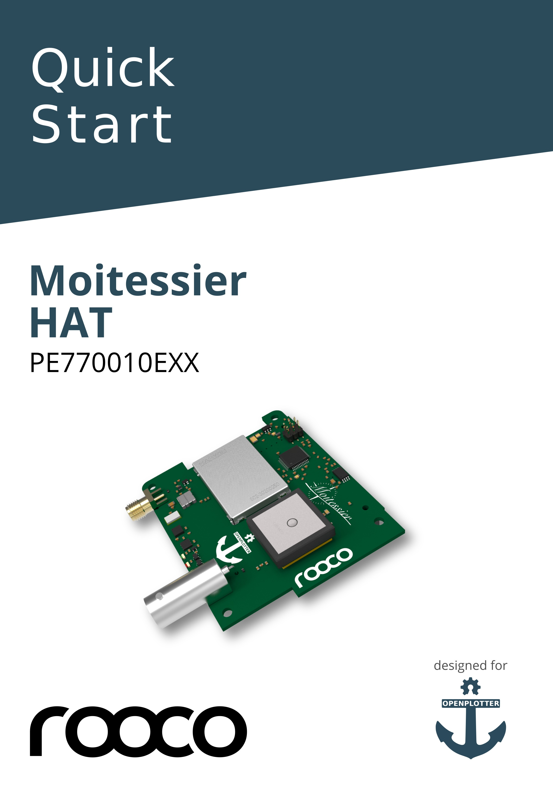
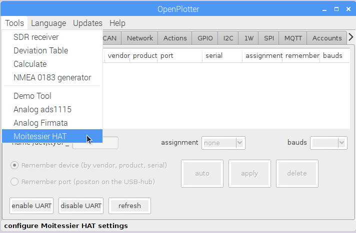
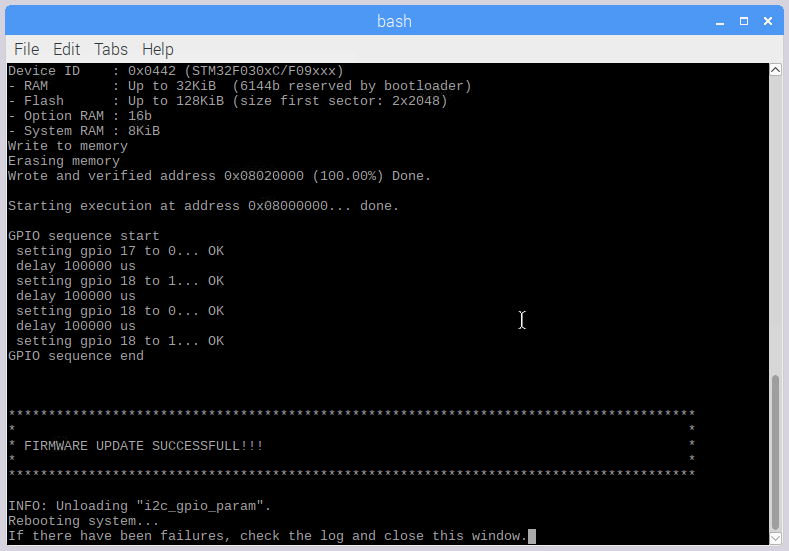
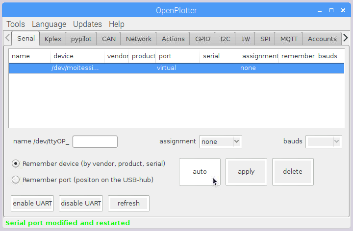
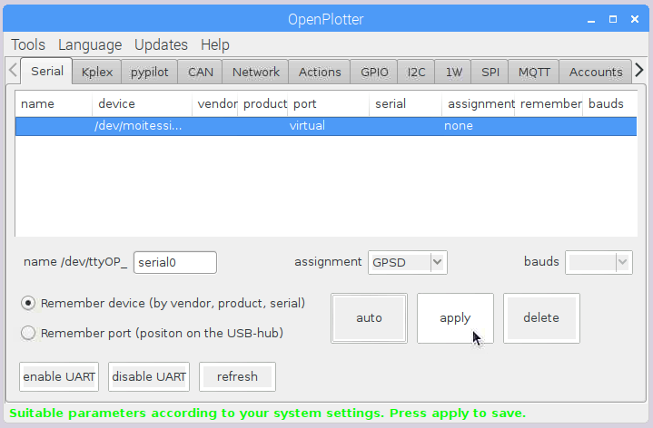
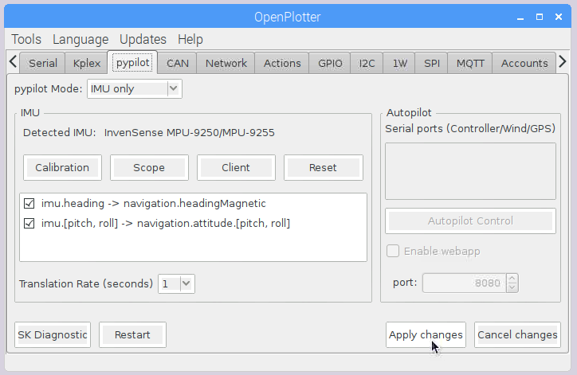

# Moitessier HAT

## Features

* High-sensitivity \(better than -112 dBm\) **dual channel AIS receiver** with SMA antenna connector.
* High-performance **GNSS receiver** with integrated patch antenna and external antenna support via BNC connector.
* **Compass**, **heel** and **trim** from gyroscope, accelerometer and magnetometer sensors \(IMU\).
* **Barometric pressure**.
* Standalone usage or in combination with Raspberry Pi \(\). Sensors are directly accessible via Raspberry Pi. Standalone usage requires 3.3V power supply and sensors are controlled by the HAT’s microcontroller
* Fully compatible with Raspberry Pi models supporting 40-pin IO header.
* Data communication via SPI \(AIS, GNSS and meta data\) and via I2C \(sensor data\). Data accessible via device driver and device file.
* Supports ID EEPROM and automatic device tree loading
* 3 status LEDs \(AIS status, GNSS status, error\)
* Full OpenPlotter compatible.


This item is available in our [Web Shop](http://shop.sailoog.com).


## Mounting the HAT

## Removing the HAT


You can damage your Raspberry or your HAT if you do not remove it carefully, please watch this video before removing: [https://vimeo.com/273692504](https://vimeo.com/273692504)


## Installing drivers


Before installing Moitessier HAT drivers [update to the latest OpenPlotter](https://docs.sailoog.com/openplotter-v1-x-x/getting-started#updating) version.


After mounting the HAT go to _OpenPlotter - Tools - Moitessier HAT_. A small window will open, press _start_.

A new window will open and you will see:

_Moitessier HAT is attached._   
_Moitessier HAT package is not installed!_

Go to _Install_ tab and check your Kernel version. Only the first 3 figures are important, in this case _4.14.34_

Select the package matching your Kernel version in _Available packages_ field and press _Install_. 

A terminal window will open. The drivers will be installed and the firmware of the HAT will be updated. The system will automatically reboot at the end of the process.


If your HAT stops working after a major OpenPloter update, this means that your Kernel has been updated too. In this case go back to this window and repeat the procedure. If a matching package does not exist, please contact us as soon as possible.


## Configuring GNSS and AIS reception

After installing drivers a new device should appear in _Serial_ tab. Select the new device an press _auto_.

The system will find the best settings for you. 

* You can change the field _name /dev/ttyOP\__ value as you want \(only numbers, lowercase letters and no symbols or spaces\). 
* You could set the _assignment_ field value to _Kplex_ too but we recommend _GPSD_. 
* Select _Remember port \(position on the USB-hub\)_ only if the HAT creates some conflict with another device.

Press _apply_ and you are done! go to OpenCPN and you should get position and AIS targets.

## Configuring compass, heel and trim reception

To enable magnetic heading, heel and trim reception you have to go to _pypilot_ tab.

Select _IMU only_ in _pypilot mode_ or _basic autopilot_ if you have a pypilot installation.

Check the type of data you want to enable, heading or/and trim and heel \(pitch, roll\).

Select a translation rate \(0.5 or 1 second should be enough\).

Press _Apply changes_ and you are done!

Open OpenCPN and check that you are getting magnetic heading data.

There are not NMEA 0183 standard sentences for trim and heel so you will not be able to check this in OpenCPN. Open any Signal K data viewer and you will see data for pitch and roll flowing.

OpenPlotter constantly and automatically calibrates the IMU in order to get accurate magnetic heading readings. Read the calibration chapter to follow some advices:



## Configuring pressure reception

Moitessier HAT has a MS5607-02BA03 sensor for barometric pressure and temperature. Atmospheric pressure readings are reliable, but temperature readings can not be considered reliable because it is affected by the temperature of the HAT and the Raspberry. However, it is a good way to get the temperature of your system.

To learn how to configure this feature, go to I2C chapter and follow the example:



## Getting info from the HAT


Work in progress.


## Advanced settings


Work in progress.


## Enclosure


Coming soon



This item is available in our [Web Shop](http://shop.sailoog.com).


## External antennas

### AIS

You need to connect a suitable VHF antenna to the HAT in order to be able to get AIS targets. The HAT uses an **SMA female connector** for AIS reception. If your antenna uses a different connector you will need an adapter.

### GNSS

There is an integrated patch antenna for GNSS and it should be enough for most cases but if you have a metallic boat or you place the HAT under metallic equipment, you may need an optional external GNSS antenna. The HAT uses a **BNC female connector** for GNSS reception. If your antenna uses a different connector you will need an adapter.


This item is available in our [Web Shop](http://shop.sailoog.com).


