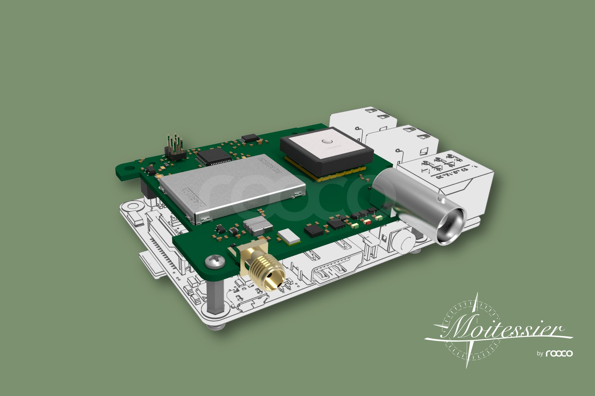

# Moitessier HAT

## Features

* High-sensitivity \(better than -114 dBm\) **dual channel AIS receiver** with SMA antenna connector.
* High-performance **GNSS receiver** with integrated patch antenna and external antenna support via BNC connector.
* **Compass**, **heel** and **trim** from gyroscope, accelerometer and magnetometer sensors \(IMU\).
* **Barometric pressure**.
* Standalone usage or in combination with Raspberry Pi \(\). Sensors are directly accessible via Raspberry Pi. Standalone usage requires 3.3V power supply and sensors are controlled by the HAT’s microcontroller
* Fully compatible with Raspberry Pi models supporting 40-pin IO header.
* Data communication via SPI \(AIS, GNSS and meta data\) and via I2C \(sensor data\). Data accessible via device driver and device file.
* Supports ID EEPROM and automatic device tree loading
* 3 status LEDs \(AIS status, GNSS status, error\)
* Full OpenPlotter compatible. Plug and play.


[www.rooco.eu](https://www.rooco.eu/)



This item is available in our [Web Shop](http://shop.sailoog.com).


## Mounting the HAT

### Enclosure


This item is available in our [Web Shop](http://shop.sailoog.com).


### External antennas


This item is available in our [Web Shop](http://shop.sailoog.com).


## Installing drivers

## GNSS, AIS settings

## Compass, heel and trim settings



## Pressure sensor settings

## Getting info from the HAT

