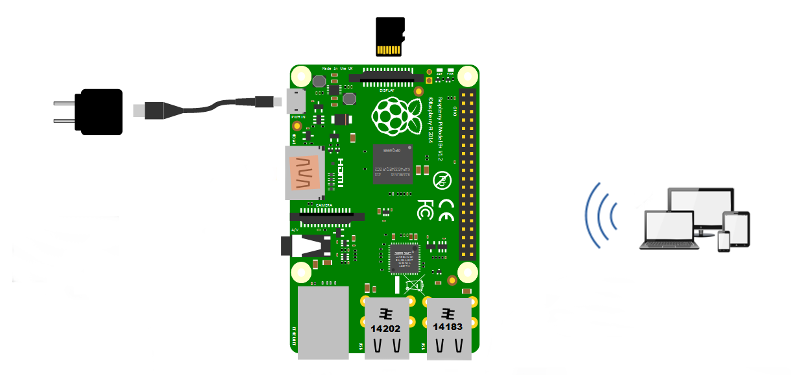

# De quoi avez-vous besoin?

Vous aurez besoin d’éléments requis et de quelques autres optionnels. Cela dépend du type de données que vous voulez collecter, analyser ou afficher et de quel équipement votre bateau dispose..

### Eléments requis

A minima, vous aurez besoin de ces éléments pour exécuter Openplotter et vous avez deux options : Avec ou sans écran.

Si vous avez besoin d’aide avec ces éléments basiques, reportez-vous à la [documentation officielle Raspberry Pi](https://www.raspberrypi.org/learning/hardware-guide).

Vous pouvez vous procurer ces éléments de base auprès d'un distributeur officiel, ou dans l'une quelconque des boutiques Raspberry.

### Option avec écran

* **Raspberry Pi 3B or 3B+** \(Ni le RPi Zero ou le 1 ne sont compatibles. Le RPi 2B a quelques limites\)
* **Boitier**
* **Alimentation**
* **Ecran HDMI**
* **Clavier et sourie**
* **Carte SD card avec OpenPlotter** \(le logiciel\)

### Option sans écran

* **Raspberry Pi 3B or 3B+** \(Ni le RPi Zero ou le 1 ne sont compatibles. Le RPi 2B a quelques limites\)
* **Boitier**
* **Alimentation**
* **Carte SD card avec OpenPlotter** \(le logiciel\)
* **Un portable, une tablette ou un smartphone**

## Eléments optionnels 

Nous développons, maintenons ou distribuons des appareils spécifiquement conçus pour être utiliser avec OpenPlotter, bien qu'ils puissent être utilisés avec d'autres systèmes:







Des prochains chapitres contiennent une liste d'appareils compatibles pour communiquer avec votre bateau, ainsi que des capteurs pour reccueillir des données depuis l'environnement:

















